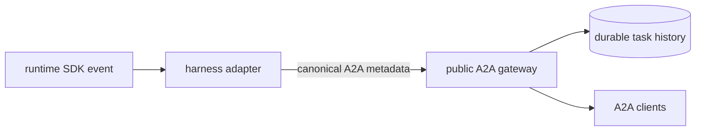

# A2A Metadata

A2A metadata extends the protocol; it does not replace it. Kagent uses native
A2A fields whenever they express the required behavior and adds metadata only
for semantics missing from the pinned A2A version.

Public kagent-owned keys use the `kagent.dev/a2a/<name>` namespace. Each key has
one meaning, an explicit owner, and a defined carrier.

## Ownership

Runtime adapters own knowledge of their SDK. They translate the small set of
runtime semantics that Kagent exposes into canonical metadata and discard the
remaining SDK metadata. A new runtime must emit the same public contract; the
gateway does not learn or translate each runtime's metadata dialect.

The gateway owns routing, trust-boundary checks, persistence, and the metadata
derived from those responsibilities. It removes caller-supplied values for
gateway-owned fields before setting them itself. Otherwise, it relays canonical
runtime metadata and preserves application or negotiated extension metadata.

Consumers read only native A2A fields and the canonical Kagent keys. They do not
interpret runtime-specific metadata.

## Current contract

| Key                                   | Carrier             | Meaning                                                                                              |
| ------------------------------------- | ------------------- | ---------------------------------------------------------------------------------------------------- |
| `kagent.dev/a2a/timeline-position`    | message or artifact | Temporary RFC 3339 timestamp used to order task history until the upstream A2A timeline is available |
| `kagent.dev/a2a/task-created-at`      | task                | Durable task creation time used by task projections                                                  |
| `kagent.dev/a2a/part-type`            | data part           | Semantic data kind, including function calls and function results                                    |
| `kagent.dev/a2a/usage`                | task event          | Model usage reported by runtimes that support it                                                     |
| `kagent.dev/a2a/output-schema-sha256` | result part         | Binds a structured result to the compiled output schema                                              |

Timeline positions are written at the boundary producing an item: the gateway
for inbound messages and runtime adapters for outbound messages and artifacts.
The gateway remains responsible for applying the resulting durable order.

## Other metadata

Versioned A2A extensions, such as the human-in-the-loop extension, keep their
negotiated URI as the metadata key. Private gateway-to-runtime continuation
state uses an internal URI and is consumed before the message can enter public
history.

Unknown application metadata is currently preserved. A future gateway
allowlist can narrow what crosses the public boundary without changing the
ownership rule: adapters translate runtime internals, while the gateway
enforces the public contract.
